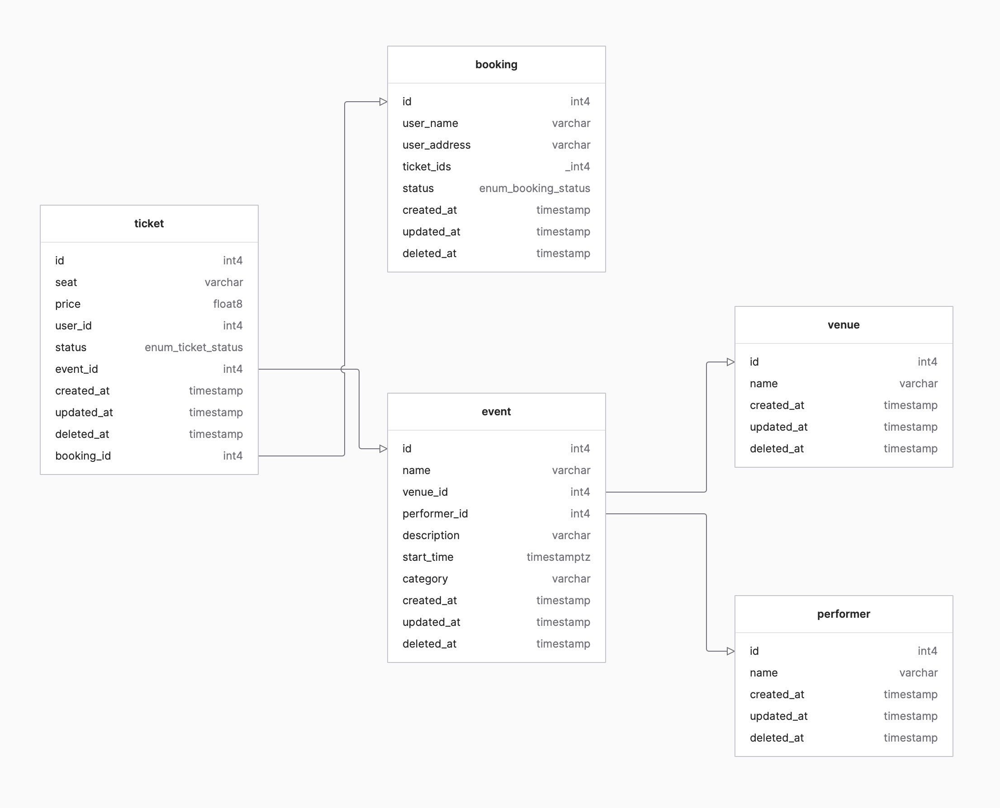

# ticket-buyer
This project is a REST api implementation for TickerMaster. Primarily written in Go, it covers only a few features from the actual TickerMaster app.

## 🚀 Getting started
**Prerequisites:** Docker and Docker Compose installed
```bash
git clone https://github.com/hasnatinter/ticket-buyer
cp .env.sample .env
docker compose up -d --build
RUN migrations: ./bin/migrate up
```
Now the project should be running on localhost:8081

## 🧰 Tools and techs
- Use of Docker, Docker compose, Go linters
- Use of [Zerolog](https://github.com/rs/zerolog) to generate all requests logs and centralise the Syslog logging.
- Use of [Gorm](https://gorm.io/) for database repositories and query methods.
- Use of [Goose](https://github.com/pressly/goose) to build a DB migration CLI with embedded migrations.
- Use of [Validator.v10](https://github.com/go-playground/validator) to validate API requests via Go generics-based, fail-fast validation middleware.
- Use of [Swag.v2](https://github.com/swaggo/swag) to generate OpenAPI v3 specifications.
- Use of [Compile Daemon](https://github.com/githubnemo/CompileDaemon) to automate go build on .go files changes.

|Go 1.26rc2 Image Size | Postgres v18 Image Size |
|----------------------|-------------------------|
| 1.2 GB               | 400MB                   |

## 🔑 Database structure


## Endpoints
| Name        | HTTP Method | Route          |
|-------------|-------------|----------------|
| Health      | GET         | /healthcheck   |
| List Events | GET         | /v1/events     |
| Read Event  | GET         | /v1/events/{id}|

## 🗂️ Folder structure
```shell
├── docker-compose.yml
├── Dockerfile
│
├── openapi-v3.yml
│
├── go.mode
├── go.sum
│
├── internal
│   ├── api
│   │   ├── event
│   │   │   └── handler.go
│   │   │   └── model.go
│   │   │   └── repository.go
│   │   ├── booking
│   │   │   └── handler.go
│   │   │   └── model.go
│   │   │   └── repository.go
│   │   ├── performer
│   │   │   └── model.go
│   │   ├── venue
│   │   │   └── model.go
│   │   ├── ticket
│   │   │   └── model.go
│   │   │   └── repository.go
│   │   ├── health
│   │   │   └── handler.go
│   └── router
│       └── router.go
│   └── server
│       └── server.go
│   └── conn
│       └── db_connection.go
│
├── config
│   └── config.go
│
├── cmd   # 💡Entrypoint for app and migrate executables
│   ├── app
│   │   └── main.go
│   └── migrate
│       ├── main.go
│       └── migrations
│           └── # 💡 All the migrations .sql files
│
└── pkg (middleware, logger, validator, errors)
```

## 📖 API Documentation
OpenAPI v3 spec available at `openapi-v3.yml`